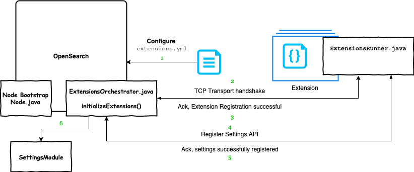

# Extensions

*Note*: This document is evolving and is in draft state.

Plugin architecture enables extending core features of OpenSearch. There are various kinds of plugins which are supported.
But, the architecture has significant problems for OpenSearch customers. Importantly, plugins can fatally impact the cluster
i.e critical workloads like ingestion/search traffic would be impacted because of a non-critical plugin like s3-repository failed with an exception.

This problem is exponentially grows when we would like to run a 3rd Party plugin from the community.  
As OpenSearch and plugins run in the same process, it brings in security risk, dependency conflicts and reduces the velocity of releases.

Introducing extensions, a simple and easy way to extend features of OpenSearch. It would support all plugin features and enable them to run in a different process or another node via OpenSearch SDK.

Meta Issue: [Steps to make OpenSearch extensible](https://github.com/opensearch-project/OpenSearch/issues/2447)  
Sandboxing: [Step towards modular architecture in OpenSearch](https://github.com/opensearch-project/OpenSearch/issues/1422)  
Security: [Security for extensions](SECURITY.md) 

## Plugins Architecture


Plugins are installed via [`opensearch-plugin`](https://github.com/opensearch-project/OpenSearch/blob/main/distribution/tools/plugin-cli/src/main/java/org/opensearch/plugins/InstallPluginCommand.java) and are class loaded into OpenSearch.
Plugins run within OpenSearch as a single process. Plugins interface with OpenSearch via extension points which plug into the core modules of OpenSearch.
This [blog post](https://opensearch.org/blog/technical-post/2021/12/plugins-intro/) helps untangle how plugins work. 

Walking through an example, a Plugin would like to register a custom setting which could be toggled via Rest API by the user. 
The plugin uses compiles with OpenSearch x.y.z version and generates a `.zip`.   
This `.zip` file is installed via `opensearch-plugin` tool which unpacks the code and places it under `~/plugins/<plugin-name>`.
During the bootstrap of OpenSearch node, it class loads all the code under `~/plugins/` directory. `Node.java` makes a call to get all settings the plugins would like to register. These settings are used as `additionalSettings` and construct `SettingsModule` instance which tracks all settings.

## Extensions Architecture



Extensions are independent processes which are built using `opensearch-sdk`. They communicate with OpenSearch via [transport](https://github.com/opensearch-project/OpenSearch/tree/main/modules/transport-netty4) protocol which today is used to communicate between OpenSearch nodes.  
Extensions are designed to extend features via APIs which are exposed using extension points of OpenSearch.  

### Discovery
Extensions are discovered and configured via `extensions.yml` which is read by OpenSearch during the node bootstrap. `ExtensionsOrchestrator` reads through the config file at `~/extensions` and registers extensions within OpenSearch.
Here is an example extension configuration `extensions.yml`:

```
extensions:
  - name: opensearch-sdk
    uniqueId: opensearch-sdk-1
    hostName: 'sdk_host'
    hostAddress: '127.0.0.1'
    port: '4532'
    version: '1.0'
    description: Extension for the Opensearch SDK Repo
    opensearchVersion: '3.0.0'
    javaVersion: '14'
    className: ExtensionsRunner
    customFolderName: opensearch-sdk
    hasNativeController: false	
```


### Communication
As we are running extensions on the port defined in the `extensions.yml`, the communication between OpenSearch and Extensions happens using a ServerSocket which binds the port and the host address. OpenSearch will initialize the extensions during the bootstrap by making a request to all the extensions running on different ports and thus creating a medium for the future requests.

### OpenSearch SDK
Currently, plugins relies on extension points to communicate with OpenSearch. To turn plugins into extensions, all the extension points should be converted into Transport APIs which will be present in the SDK. Plugins need to integrate SDK, call those APIs, and later SDK will take care of the communication and the required attributes from OpenSearch.

### Latency
https://github.com/opensearch-project/OpenSearch/issues/3012#issuecomment-1122682444

### Settings
Walking through a similar example as plugin above, after extension registration is done, extension makes an API call to register custom settings to OpenSearch.
`ExtensionsOrchestrator` recieves the requests, forwards it to `SettingsModule` to register a new setting and wala, the user is now able to toggle the setting via `_settings` Rest API.

## FAQ

- Will extensions replace plugins?  
  We see value in plugins as they are high performant which works well for index/search workloads.
  